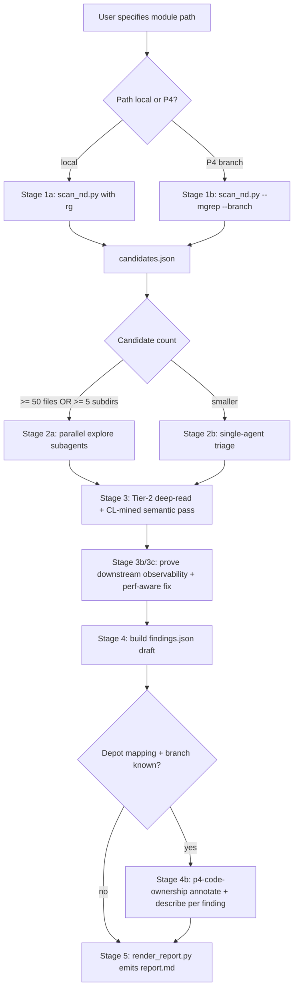

# ND Code Analyzer (v1.4.0)

## Overview

Find static (source-code-level) non-determinism issues in C++ modules and
emit a structured markdown report with severity classification and
context-specific before/after fix suggestions.

**Real ND is not a regex hit.** A finding is real only after tracing the
suspect source to downstream C++ code that can observe nondeterministic
behavior: a mutating sink, tie-break decision, output/report order, message
order, persisted database state, QoR-affecting algorithm choice, or floating
aggregation result. If that proof is missing, classify the row as latent-only,
false positive, dead/unused, safe adopter, mirror duplicate, or neutralized.

**This skill covers source-code analysis only.** Runtime ND debugging
(threading races, memory order, flow-level repeatability) is covered by
`hubble_v0.2/mgupta-skills/non-determinism` and `general/ndm-debugging`.
The `concurrency` category (patterns 4.1-4.6, anchored on P2-002) covers
**static** MT-ND source shapes -- lazy dirty-bit recompute in const getters,
first-touch materialization, inconsistent lazy-cache locking, mutable const
RMW counters, concurrent_hash_map check-then-act, lost-wakeup, and address-keyed
lock striping. Detection is static; observability is still confirmed via the MT
hunt / TSan, and realness follows the same prove-nd discipline.

**Mandatory C++ navigation.** When the analysed module lives under
`nwtn/src`, every Stage 2/Stage 3 deep read that needs go-to-definition,
find-references, hover, symbol search, or cross-module type resolution
MUST use the `nwtn-src-cpp-code-navigation` skill (clangd_query.py).
This is required for the iterated-symbol type lookup rule under Pattern 3.3.

**Perforce code ownership.** When a confirmed finding maps to dgplt depot
paths (see **`p4-code-ownership`**), the agent MUST resolve **who introduced
or last materially edited** the ND call site before final reporting: depot
resolution, line-window `p4 annotate -c`, then `p4 describe` on the dominant
CL(s), following the **p4-code-ownership** workflow (including CMT merge
chain resolution). Populate each finding's optional `ownership_md` field
(or state why attribution was skipped).

## Quick Start

```text
User: find ND issues in ropt/flow/thermal
User: scan opt/optutil for non-determinism
User: audit bufutil/roi/router for repeatability problems
User: check determinism of nwtn/src/preroute on branch v
```

## Workflow stages (1 → 5, with Stage 4b ownership)



### Stage 1 -- Mechanical Scan

Run `scripts/scan_nd.py` to enumerate candidates:

```bash
~/.claude/skills/nd-code-analyzer/scripts/scan_nd.py \
    --path <module-path> \
    --out candidates.json \
    [--min-severity LOW|MEDIUM|HIGH] \
    [--category sorting,container,...] \
    [--tier 1|2|all] \
    [--mgrep --branch <branch>] \
    -v
```

The scanner reads `references/nd-patterns.yaml` (27 patterns). Each
candidate carries the file:line, the matching pattern, and +/-2 lines of
context. Tier 2 patterns generate vicinity hits the LLM later confirms.

**[v1.1 addition] Pattern-specific narrowing.** Patterns whose Stage-1
regex would otherwise generate large vicinity clusters MUST also apply the
narrowing rules in section "Pattern-specific narrowing rules" below before
emitting candidates. This is enforced for patterns 1.3 (pointer-keyed
unordered container) and 3.3 (unordered iteration feeding algorithms).
Patterns 3.6 and 3.7 are intentionally broader seed searches; Stage 3 MUST
apply their narrowing rules before promoting any finding.

### Stage 2 -- LLM Triage

For each candidate, the agent:

1. Reads the file with +/-10 lines of context.
2. Confirms it's a real positive (filter against the pattern's
   `false_positive_hints_md` from the YAML).
3. Gives the call site a provisional severity only after recording its
   realness class:
   - **real** if downstream C++ can observe nondeterministic behavior.
   - **latent-only** if the suspect declaration exists but consumers are
     lookup-only, membership-only, or otherwise order-insensitive.
   - **false-positive** if type resolution shows vector/indexing/ordered
     containers, stable comparators, dead preprocessor blocks, or scanner
     pattern mismatch.
   - **safe-adopter** if the code already uses a project deterministic
     comparator/container idiom.
   - **mirror-duplicate** if the row is an include/export mirror of another
     issue and should inherit its classification.
   - **neutralized** if nondeterministic order is canonicalized before it
     reaches a consumer.
   - **dead/unused** if the code is not compiled or has no reachable caller.
4. Re-classifies severity (real findings only):
   - **HIGH** if on the algorithm's hot path or directly affects
     QoR/database state.
   - **MEDIUM** if real but gated, uncommon, or partially mitigated.
   - **LOW** if real but debug/report-only or hard to trigger.
   - Non-real rows are recorded in `dismissed_buckets` (or non-real sections
     of the report), not as HIGH/MEDIUM/LOW defects.
5. Writes a context-specific Version A/B/C fix using project idioms
   (`ndmPtrMap`, `ndmObjectHandleNS::compareObjPtr`,
   `dosContainer::keyCompare` pattern). Real findings only.
6. Records the result as either a finding or a `dismissed_buckets` entry in
   `findings.json`.

#### Parallelize triage when warranted

Dispatch parallel `explore` subagents when **either**:

- candidate count >= 50 candidate files, OR
- module spans >= 5 sub-directories.

Each subagent triages one sub-directory or one category and returns
structured JSON. The main agent merges the per-subagent findings.

For smaller modules, do a single-agent triage loop -- overhead of
spawning subagents isn't worth it.

### Stage 3 -- Tier-2 Deep Read

Tier-2 patterns (#15-21: parallel FP reduction, MT shared-container
writes, unordered iteration, `operator[]` side effects, thread-count
dependency, post-collection canonicalization, and project wrapper
containers) need data-flow reasoning beyond regex. The Stage-1 scanner
emits "vicinity" hits; Stage 3 is a focused pass that:

1. Re-reads the surrounding scope.
2. Decides whether the pattern actually affects output (e.g. is the
   reduction operand a float/double or an int? does the unordered loop
   mutate external order-sensitive state?).
3. Promotes confirmed cases into `findings.json`; drops the rest.

If you skip Stage 3 the report will over-report Tier-2 hits.

**[v1.1 addition] Iterated-symbol type lookup is mandatory for Pattern 3.3.**
For every range-for loop flagged under 3.3, the LLM MUST resolve the
iterated symbol's declared type before classifying. Required steps:

1. Identify the symbol on the right-hand side of the `for (X : symbol)`
   expression.
2. Search the file (and headers it includes from the same module) for the
   declaration of that symbol. For `nwtn/src` code, use the
   `nwtn-src-cpp-code-navigation` skill (clangd_query.py go-to-definition
   / hover) when text search is insufficient or ambiguous.
3. If the declared type is **not** an `std::unordered_*`,
   `tbb::concurrent_unordered_*`, `absl::flat_hash_*`, or
   `robin_hood::unordered_*`, **drop the candidate immediately**. Do not
   apply severity heuristics; this is a regex false positive.
4. If the declared type IS one of the above, AND its key is a raw or smart
   pointer, proceed to side-effect analysis (next bullet).
5. If the declared type IS one of the above but keyed by a deterministic
   integer / string / stable-id type, drop unless the loop body propagates
   order to a non-commutative external state.

**[v1.1 addition] Neutraliser detection.** A Pattern 3.3 candidate is also
dismissed when the loop body, or the next ~30 lines after the loop,
contains a `std::sort` / `std::stable_sort` over the aggregated container
using a deterministic key comparator. The
`tbb::enumerable_thread_specific` "concatenate then sort by original
index" idiom is the canonical example -- see "False-positive case
studies" below.

#### CL-mined semantic review checklist (v1.3)

After candidate triage, run this checklist for the analysed module. These
families came from 5-year ND-fix CL mining. Some are scanner-backed by
patterns 3.6 / 3.7; the others are reviewer heuristics and MUST NOT be
promoted without deep reading the relevant code path.

For each checklist hit, record either a finding or a dismissed bucket with
the search seed and dismissal reason. Prefer `dismissed_buckets` for broad
semantic searches that produce many benign hits.

1. **Post-collection canonicalization (pattern 3.6):** search for
   `push_back` / `emplace_back` around `nodeIdx`, `rows`, `batches`,
   `leq`, `knee`, `module`, `getNodesIdxInMBB`, and graph/bin collection
   helpers. Confirm the collection source can be unstable and there is no
   stable sort before order-sensitive use.
2. **Project wrapper containers (pattern 3.7):** search for
   `dosUnorderedMap`, `dosUnorderedSet`, `hyHash`, `hyHashI`, `hySet`,
   `hyMap`, `nwcInsOrdMap`, `ndmPtrSet`, `ndmPtrMap`, `keyCompare`,
   `keyHash`, and `charPtrCompare`. Confirm wrapper semantics, pointer-key
   behavior, insertion source stability, and result-affecting iteration.
3. **Graph / geometry traversal canonicalization:** search for
   `sortGrhNodes`, exclusion traversal macros, outside-node / in-MBB
   checks, blocker counting, and geometry sort comparators. Promote only
   when traversal boundaries or tie-break keys are incomplete.
4. **Stale cached state and deleted index cleanup:** search for `stale`,
   `cache`, `deleted`, `nodeIdx`, `edgeIdx`, `init*`, `clear*`, and
   deterministic guards around phase-local state. Promote only when stale
   state can reach later deterministic computation.
5. **Delay-sharing / cross-scene state reuse:** search timing code for
   `delay sharing`, `copyDataFrom`, `equalValues`, `compareWaveform`,
   annotations, scene reuse, arrival-memory cleanup, and `*_NdFix` app
   options. Promote only when reuse lacks a required equivalence or
   invalidation check.
6. **Concurrency / write-lock discipline:** search for
   `enableMultiThreading`, `thread safe`, `writeLock`, `suspend`, `resume`,
   and threaded write-back paths. Promote only when shared mutable design
   state is read or written without the intended lock/serialization contract.
7. **Deterministic control-path normalization:** search for
   `deterministic mode`, `state_global_field_set`, `NdFix`, and app-option
   defaults. Promote only when determinism-related control state is set on
   some branches but not others, or a known deterministic fix is defaulted
   inconsistently.
8. **Checksum / ND observability:** search for `checksum`, `dumpChecksum`,
   `reportChecksum`, and checksum payload assembly. Treat these mostly as
   investigation guidance; promote only when unstable payload fields make
   checksum output itself nondeterministic.
9. **False-positive lesson:** explicit `.begin()` / `.end()` on an ND
   container is not sufficient evidence. It is actionable only when the
   traversal order affects output, QoR, mutation order, or checksum content.

### Stage 3b -- Downstream Observability Proof

Before promoting any candidate to a real finding, prove that C++ downstream
usage can observe nondeterministic behavior.

Required proof chain:

1. **Suspect source:** identify the exact container/algorithm/random/threaded
   construct and why its order/value can vary.
2. **C++ caller/callee trace:** use `clangd_query.py` for semantic
   references/definitions when available and `mgrep` / `mgrep-agent` for
   cross-module breadth. Trace from the suspect to at least one reachable
   caller and one downstream consumer.
3. **Observable sink:** show the sink that observes the order/value:
   mutation (`set*`, `remove*`, `reorder*`, database write), algorithmic
   tie-break, persisted object state, user-visible output/message/Tcl
   recording, report order, QoR-affecting choice, or non-associative floating
   accumulation.
4. **Neutralizer pass:** explicitly look for `sort`, stable comparator,
   deterministic key conversion, set-union-only use, lookup-only use, vector
   iteration, allocator indexing, inactive `#if 0`, mirror headers, and
   debug-only paths.
5. **Controls/gating:** trace user commands, flow entry points, C++ guards,
   app options, app vars, and data conditions required to trigger the
   issue. Environment variables are treated as intentional control surfaces
   (see Out of Scope) and are not classified as ND.
6. **App-option metadata:** use `icc2query` for each relevant app option and
   record default value, hidden/unlisted/basic status when available, and
   whether the option enables, disables, or merely modifies the issue.
7. **Code/regression setters:** search C++ and `nwtn/unit` regressions for
   setters of relevant app options or command flags. Distinguish production
   code forcing a value from tests that only exercise the path.
8. **Reference-client source:** in sparse Perforce clients, if a file is
   outside local `DEVROOTS`, prefer the reference-root or remote-index source
   instead of concluding that no source/caller exists.

Do not mark a candidate real because it "could" be bad. If the downstream
consumer is lookup-only, membership-only, order-neutral, already sorted, or
unreachable, report that classification instead.

Do not use `purecov` or Coverity annotations/directives as reachability proof.
They are analysis hints, not compile-time controls. Only treat them as gating
evidence when they are backed by real preprocessor/build controls such as
`#if`, `#ifdef`, build macros, or generated-source exclusion. A `purecov`
comment or Coverity suppression alone is not enough to classify code as dead,
unused, safe, or compiled out.

### Stage 3c -- Performance-Aware Fix Direction

Fusion Compiler code is algorithm-heavy and data-structure-heavy. Many ND
suspects sit in hot optimization loops, graph traversals, database walks, and
timing/power/routing kernels where operations may execute millions or billions
of times. A deterministic fix that is correct but slow can still be the wrong
fix.

When proposing fixes:

- Do not blindly replace `unordered_*` with `std::map`/`std::set` in hot code.
  That can change O(1) lookup into O(log N), add allocator churn, and perturb
  cache locality.
- Do not add per-iteration sorting, repeated vector materialization, or large
  container copies inside inner loops unless the report explicitly justifies
  the cost.
- Prefer canonicalizing at the smallest boundary where order becomes
  observable: before output, before mutating a shared object, before a
  tie-break, or before a deterministic report.
- Preserve fast membership/lookup structures when possible and add a separate
  stable iteration vector, sorted key snapshot, cached stable order, or
  deterministic tie-break only for the consumer that needs order.
- Use existing stable IDs/comparators (`getId`, object handles,
  `dosContainer::keyCompare`, `ndmObjectHandleNS::compareObjPtr`) only when
  their cost and semantics match the sink.
- Call out expected complexity change, allocation/copy risk, data-size
  sensitivity, and whether runtime/QoR benchmarking is needed.

Every Version A/B/C fix should include a short performance note. If the
lowest-risk fix may be too expensive for a hot path, propose a more surgical
alternative and say what evidence is needed before choosing.

### Stage 4 -- Assemble `findings.json`

The agent produces `findings.json` with this shape (see
`scripts/render_report.py` docstring for the full schema):

```json
{
  "module_path": "ropt/flow/thermal",
  "module_slug": "ropt-flow-thermal",
  "search_backend": "rg",
  "branch": "main",
  "patterns_evaluated": 27,
  "findings": [
    {
      "pattern_id": "1.1",
      "pattern_name": "Pointer-based std::sort / std::stable_sort",
      "category": "sorting", "tier": 1,
      "severity": "HIGH",
      "severity_default": "HIGH",
      "file": "ropt/flow/thermal/thermalViaDeletion.cc",
      "line": 384, "col": 5,
      "title": "Pointer-based sort on vias vector",
      "description_md": "Site-specific narrative...",
      "snippet_ctx": "...code...",
      "realness": "real",
      "downstream_observability_md": "Suspect order reaches setInstances()...",
      "controls_md": "Triggered by command/flow X when guard Y is true...",
      "app_option_defaults_md": "- `foo.bar`: default false, hidden...",
      "regression_setting_md": "nwtn/unit/... sets option true in tests...",
      "performance_note_md": "Sort keys once before output; keep unordered lookup in the hot loop.",
      "fix_versions": [
        {"label": "Version A (Simple)", "code_md": "```cpp\n...\n```"},
        {"label": "Version B (Robust)", "code_md": "```cpp\n...\n```"}
      ],
      "rationale_md": "Why Version A is sufficient here.",
      "false_positive_check_md": "Type resolved; not vector/indexing; no neutralizer before sink.",
      "ownership_md": "- **Depot:** `//synopsys/nwtn/main/dev/nwtn/src/...`\n- **Primary:** ... (CL ...) — see p4-code-ownership workflow.\n"
    }
  ],
  "dismissed_buckets": [
    {
      "pattern_id": "3.3",
      "bucket_label": "Iterated symbol is std::vector (not unordered_*)",
      "count": 35,
      "rationale_md": "Stage-1 vicinity false positives; iterated container is vector. Sample sites: kudtTimer.cc:530, 545; kudtTimerForward.cc:307."
    }
  ],
  "module_specific_summary_md": "...",
  "fix_recipes_excerpt_md": "..."
}
```

**[v1.1 addition]** The new `dismissed_buckets` array lets the report
summarise how many candidates were filtered out and why. This avoids
flooding the user with per-site dismissals when the root cause is a
single regex false positive.

**[v1.4 addition]** Every promoted real finding should include `realness`,
`downstream_observability_md`, `controls_md`, `app_option_defaults_md`,
`regression_setting_md`, and `performance_note_md` when relevant. A
missing downstream proof means the row belongs in `dismissed_buckets` or a
non-real classification section, not in the defect list. The renderer
treats these fields as optional, so partial sets degrade gracefully.

### Stage 4b -- Perforce code ownership (**p4-code-ownership**)

After triage yields the draft `findings.json`, enrich **each confirmed
finding** with ownership using the **`p4-code-ownership`** skill workflow:

1. **Resolve depot path** from the finding's workspace-relative path
   (`nwtn/src/...`) using the mapping in **p4-code-ownership** (e.g.
   `//synopsys/nwtn/<branch>/dev/nwtn/src/<relative>`). If unsure, read
   the client **`View:`** mapping with `p4 client -o` as documented there.
   Carry `branch` in `findings.json` (`search_backend: mgrep` runs should
   set this consistently).

2. **Line-window blame:** run `p4 annotate -c` on the depot file and isolate
   the CL(s) spanning the finding line (use a small line range around the
   flagged line, not the whole file, when findings are clustered).

3. **CL narrative:** run `p4 describe -s` on the dominant CL(s). Resolve
   **CMT/integration** chains to the **original authoring user** using the
   tips in **p4-code-ownership** (`[ORIG_CLIENT:...]`, merge/copy chain).

4. **Optional breadth:** use `mgrep` / `p4 grep` for hot APIs at the site
   only when the user asked for reviewer suggestions or broader ownership —
   primary ND attribution should stay annotate/describe based.

**Severity policy:**

- **HIGH** — ownership block is **mandatory** when depot path + branch can
  be resolved; if not resolvable, set `ownership_md` to explain why (pure
  local mirror without P4 mapping, unknown branch, etc.).
- **MEDIUM / LOW** — **recommended** unless the user disables attribution;
  omit with a short reason if cost is excessive.

Optional structured fields **may** be added alongside narrative for tooling;
the renderer emits the markdown block **`ownership_md`** verbatim.

**Populate `ownership_md`** (Markdown bullets, example):

- **Depot:** `//synopsys/nwtn/main/dev/nwtn/src/.../file.cc`
- **Primary logic (annotate):** user `acct` — CL `9949380` (last touched
  lines ~380–392)
- **Describe summary:** …
- **Notes:** e.g. CMT integrate — original author traced to CL …

Omit detailed ownership bullets **only** when strictly out of scope (pure
local tree with no depot mapping; user disables attribution)—then briefly
explain in `ownership_md` or omit the field consistently with the HIGH
severity policy above.

### Stage 5 -- Render Report

```bash
~/.claude/skills/nd-code-analyzer/scripts/render_report.py \
    --findings findings.json \
    [--out report.md]
```

If `--out` is not given, the report is written to
`~/.cursor/plans/nd_analysis_<slug>_<YYYYMMDD>_<hash>.md`.

The renderer prints the final path on stdout and a summary on stderr.

## Pattern-specific narrowing rules (v1.1 / v1.3 additions)

### Pattern 1.3 -- pointer-keyed unordered container

**Stage-1 emit only when ALL are true:**

- Container declaration matches
  `std::unordered_(set|map|multiset|multimap)<\s*T\s*\*` (raw pointer key),
  or one of the project's smart-pointer wrappers (`ndmObjectHandle`,
  `ndmInstPtr`, ...) with no custom hash/comparator.
- Container type does NOT explicitly pass a stable hash/comparator
  template argument (e.g. `ndmObjectHandleNS::ptrHash`,
  `ndmPtrMapHash`, `compareObjPtr`).
- The container variable is also iterated somewhere in the same
  translation unit (range-for, `begin()/end()`, structured bindings).

**Auto-dismiss without LLM** when:

- Container is only consumed via `find` / `count` / `contains` /
  `insert` / `erase` (membership-only usage).
- Container declaration uses a project-blessed stable hash/comparator.

### Pattern 3.3 -- unordered_* iteration feeding algorithms

**Stage-1 emit only when ALL are true:**

1. The file declares at least one `std::unordered_*` (or alias) AND that
   container is keyed by a pointer (smart or raw) without a stable
   hash/comparator. Integer-keyed unordered containers are NOT flagged
   at Stage 1.
2. The range-for's RHS expression contains the *name* of one of those
   declared containers (textual cross-check).
3. The next ~30 lines of the loop body contain at least one of:
   - `push_back` / `emplace_back` / `insert(end(), ...)` / `+=` / `-=`
     into an externally-visible container that is later consumed in
     iteration order;
   - `std::accumulate` / `std::reduce` / `std::transform_reduce` whose
     accumulator is `float`, `double`, or a non-commutative type;
   - assignment to an external scalar of the form `result = f(result, ...)`
     where `f` is non-commutative.

**Auto-dismiss without LLM** when:

- The range-for is immediately followed by a `std::sort` /
  `std::stable_sort` of the aggregated output using a deterministic
  comparator (the "TBB-aggregate-then-sort" idiom).
- The loop body's only side effects are set-union (`insert(begin, end)`),
  atomic `fetch_add`, write to an ordered `std::map<K, V>` keyed by a
  loop-local deterministic key, or computation of a deterministic scalar.

### Pattern 3.3 sub-rule: `tbb::enumerable_thread_specific` aggregation

Recognise the canonical idiom and dismiss it as a unit:

```cpp
for (const auto& localX : threadLocalXs) totalSize += localX.size();
allXs.reserve(totalSize);
for (const auto& localX : threadLocalXs) allXs.insert(allXs.end(), localX.begin(), localX.end());
std::sort(allXs.begin(), allXs.end(), <deterministic-key-cmp>);
```

The first two range-for loops have thread-creation-order-dependent
visit order, but the closing `std::sort` with a deterministic key
canonicalises the result. Stage 1 SHOULD detect this shape and emit
zero candidates for the two loops. If detection is too brittle, Stage 3
MUST recognise it.

### Pattern 3.6 -- post-collection use without canonical ordering

**Stage-1 emit broadly; Stage 3 MUST narrow.** Pattern 3.6 regexes are
intentionally seed searches, not proof of ND.

Promote only when ALL are true:

1. The collection is populated from a traversal, graph/bin query,
   hash-backed source, MT collection, or helper whose order is not documented
   stable.
2. The collection is consumed before an explicit `std::sort` /
   `std::stable_sort` / project canonicalization helper.
3. The consumer is order-sensitive: first-match selection, ranking,
   mutation, output/checksum emission, or non-commutative accumulation.

Auto-dismiss when:

- The source helper is documented to return canonical order.
- A deterministic sort/canonicalization happens before the first
  order-sensitive consumer.
- The collection is used only for logging, counting, set membership, or
  commutative/idempotent aggregation.

### Pattern 3.7 -- project wrapper containers with order-sensitive use

**Stage-1 emit broadly; Stage 3 MUST narrow.** Pattern 3.7 exists because
many CL-mined fixes used project wrappers rather than STL declarations.

Promote only when ALL are true:

1. The wrapper semantics are known: unordered/hash-backed, comparator-sorted,
   or insertion-order preserving.
2. Pointer keys or pointer-derived comparators/hashes are involved, OR the
   wrapper preserves insertion order from a source that may be unstable.
3. Iteration, first-match selection, report/checksum emission, mutation
   order, or ranking depends on the wrapper's observed order.

Auto-dismiss when:

- The wrapper already uses a stable comparator/hash and the code only does
  membership lookup (`find`, `count`, `contains`, `insert`, `erase`).
- `ndmPtrSet` / `ndmPtrMap` is clearly being used as the fix and identity
  order is the intended contract.
- `hySet` / `hyMap` insertion order is fed by an already canonical source,
  or the downstream consumer sorts before result-affecting use.

## False-positive case studies (lessons learned)

### Case study: opt/optGpu Pattern 3.3 grouping (62 sites, 0 confirmed defects)

Anchor `nwtn/src/opt/optGpu/kudt/kudtInterf.h:263`. Full report at
`./optGpu-pattern-3.3-iteration-false-positives.md`.

Root cause: Stage-1 emitted one hit per range-for in any file declaring an
`std::unordered_*` container. In a 5-file scope, this produced 62 hits.
Distribution after type-resolution:

- 35 sites iterated `std::vector<...>` (not unordered).
- 10 sites iterated `std::set<...>` or `std::map<...>` (ordered).
- 7 sites iterated `tbb::enumerable_thread_specific<vector<...>>` followed
  by a deterministic sort (canonical TBB aggregation idiom).
- 5 sites iterated per-thread vectors inside `tbb::combinable` followed by
  the same sort idiom.
- 5 sites actually iterated `std::unordered_map/set<uint32_t, ...>`, all
  with order-independent side effects (set union, atomic `fetch_add`,
  write to ordered `std::map`, or deterministic scalar computation).

After applying the proposed Stage-1 narrowing rules, 0 of the 62 sites
would be emitted.

Lessons baked into v1.1:

- Pointer-keyed unordered containers are the actual concern; integer-keyed
  containers iterate deterministically given a deterministic insertion
  sequence.
- The `tbb::enumerable_thread_specific` aggregation idiom is so common in
  performance-sensitive code that it deserves a dedicated dismiss rule.
- Set-union and commutative atomic side effects are textbook safe.

## Input Contract

The user invokes the skill with one of:

- A local directory path (`/path/to/module`).
- A Perforce path (`nwtn/src/ropt`) and a branch name -- use `--mgrep`.
- Optional category filter (`sorting`, `container`, `random`, etc.).
- Optional severity floor (`HIGH` for "only the urgent stuff").
- Optional tier filter (`1` for fast scan, `2` for parallel-only audit).

## Output Contract

A single markdown report with:

1. **Executive summary** -- severity counts, by-category breakdown, top-5
   hot files.
2. **Critical background** -- ID system reminder (cost table, gold-standard
   tools).
3. **Top summary table** -- one row per real finding: issue, realness,
   triggering controls/app options, and short summary. Lets a reader scan
   the defect surface without reading every section.
4. **HIGH / MEDIUM / LOW sections** -- real issues only, grouped by pattern
   with per-issue title, file:line, current code snippet, Version A/B/C
   fix, and rationale.
5. **Downstream proof** -- per real issue, cite suspect source,
   caller/callee path, observable sink, controls/gating, app-option
   defaults, and code/regression setters (from Stage 3b).
6. **Performance-aware fix direction** -- per real issue, explain whether
   the proposed fix changes lookup complexity, adds sorting/copying/
   allocation, or needs runtime/QoR validation (from Stage 3c).
7. **Non-real classifications** -- latent-only, false-positive,
   safe-adopter, mirror-duplicate, neutralized, dead/unused, with
   evidence. Distinct from `dismissed_buckets` (which groups regex-level
   filters); this section explains realness verdicts that required deep
   reading.
8. **Generic fix patterns** -- excerpts from `references/fix-recipes.md`.
9. **Coding guidelines** -- DO / DON'T list.
10. **Module-specific summary** -- narrative paragraph describing the
    module's overall ND posture.
11. **[v1.1 addition] Dismissed buckets** -- summary of regex false
    positives, grouped by root cause, so the user can verify the scanner
    filtered correctly without per-site triage.
12. **[v1.2 addition] Code ownership (Perforce)** -- per-issue block from
    `ownership_md` (HIGH mandatory when depot mapping exists), populated
    via **p4-code-ownership**.
13. **[v1.3 addition] CL-mined semantic checklist coverage** -- either
    confirmed findings or dismissed buckets for the non-regex-friendly
    families in the Stage 3 checklist, so the report shows that these
    issue classes were considered.
14. **Verification notes** -- commands/tools used, failed navigation
    attempts (e.g. `clangd_query.py` symbol misses), source roots used
    (local DEVROOTS vs. reference root vs. remote index), and scope limits
    (files skipped, time budget, dropped categories).

## When to Use Subagents

| Module size                           | Approach                                                     |
| ------------------------------------- | ------------------------------------------------------------ |
| < 50 candidate files AND < 5 subdirs  | Single-agent triage loop                                     |
| >= 50 candidate files OR >= 5 subdirs | Parallel `explore` subagents, one per subdir or per category |
| Tier-2 audit only                     | One subagent per Tier-2 pattern                              |

When dispatching subagents, give each subagent: (a) the candidates JSON
slice for its scope, (b) the YAML for the patterns it owns, and (c)
explicit instructions to return JSON in the `findings` element shape.
**Ownership:** Prefer a single merge pass **after** all subagents return
(stage 4b centrally) so `p4-code-ownership` stays consistent across one
branch; parallel subagents may leave `ownership_md` blank for the merger
to fill.

## How to Extend

To add a new ND pattern:

1. Append a new entry to `references/nd-patterns.yaml` with a fresh `id`.
2. Add a corresponding section to `references/nd-patterns.md` (the
   narrative mirror).
3. If the pattern needs Tier-2 reasoning, set `tier: 2` and write
   triage questions in the description.

Adding a pattern typically requires **no** edits to `scan_nd.py` when the YAML
regexp alone suffices, and **no** edits to `render_report.py` per pattern
(renderer is pattern-agnostic). Extend `render_report.py` only when adding
new top-level report fields beyond the documented `findings[]` schema.

**[v1.1 addition]** If the new pattern needs Stage-1 narrowing beyond a
single regex (i.e., it must check declared types or look for
neutralisers), document the rule under "Pattern-specific narrowing
rules" in this file and reference it from the pattern's YAML entry.

## Reference Documents

- [`references/nd-patterns.yaml`](references/nd-patterns.yaml) -- machine-readable catalog (scanner input).
- [`references/nd-patterns.md`](references/nd-patterns.md) -- narrative mirror (LLM reads during triage).
- [`references/fix-recipes.md`](references/fix-recipes.md) -- generic Version A/B/C fix templates.
- [`references/id-system.md`](references/id-system.md) -- ID cost table + gold-standard comparator/hasher.
- [`assets/example_report.md`](assets/example_report.md) -- anonymized sample output to mimic.
- **`p4-code-ownership`** (global skill `~/.claude/skills/p4-code-ownership/SKILL.md`) -- depot mapping, `p4 annotate`, `filelog`, `describe`, CMT chains, reviewer template.

## Out of Scope

- **Runtime ND debugging** -- covered by
  `hubble_v0.2/mgupta-skills/non-determinism` and `general/ndm-debugging`.
  (The `concurrency` category 4.1-4.6 detects MT-ND *statically*; the runtime
  race confirmation itself stays out of scope and is handed to the MT hunt / TSan.)
- **Auto-applying fixes** -- this skill outputs suggestions only; the user
  applies them manually or asks separately.
- **Environment-variable controls** -- `getenv()` / `std::getenv()` are
  intentionally used like app options to make the tool behave differently.
  Do not classify env-var-driven behavior as ND and do not emit findings
  solely because code reads an environment variable.
- **Excluded patterns:** uninitialized memory (sanitizers), async-signal
  handlers, locale issues, atomic memory ordering, RTTI demangling.
