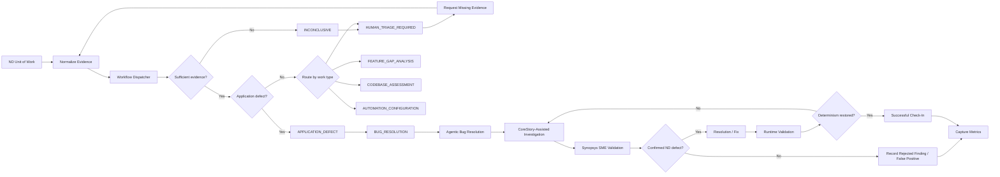
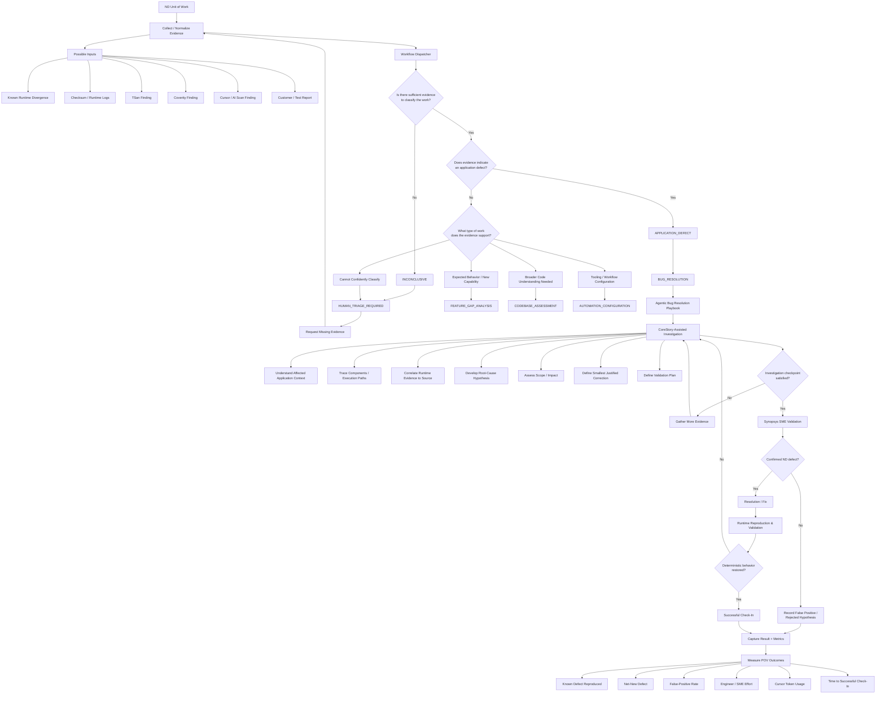

# Non-Determinism Workflow — Conceptual Architecture

> **Status:** Draft / theoretical. Subject to validation against Synopsys workflow artifacts, known defects, runtime evidence, and existing Cursor skills.

This document captures a high-level proposed workflow for non-determinism (ND) investigation and resolution. The intent is to integrate with the customer's existing runtime-driven diagnosis process rather than replace it.

## Presentation View

## Detailed Workflow View

## Proposed Control Flow

1. **Evidence intake** — create an ND unit of work from runtime divergence, checksum logs, TSan, Coverity, Cursor/AI scans, or another observed failure.
2. **Workflow dispatch** — classify the work before performing a full investigation.
3. **Playbook routing** — route a supported application defect to `BUG_RESOLUTION` and the Agentic Bug Resolution playbook; route other work according to the dispatcher taxonomy.
4. **CoreStory-assisted investigation** — use application intelligence to understand affected components, execution paths, relationships, likely impact, and relevant source before proposing a correction.
5. **Human validation** — retain Synopsys SME validation as the authority for whether the suspected ND condition is a real defect.
6. **Runtime validation** — verify that any correction restores deterministic behavior using the appropriate reproducible runtime test.
7. **Measurement** — capture result quality, false positives, engineer/SME effort, token usage, and time to successful check-in.

## Open Design Questions

The following are intentionally unresolved until customer artifacts are available:

- Whether Synopsys's existing ND Cursor skills should be invoked inside Agentic Bug Resolution or require a separate ND-specific playbook.
- The exact normalized schema for an ND unit of work.
- How checksum/runtime evidence should be parsed, summarized, and passed between workflow stages.
- Whether TSan, Coverity, runtime divergence, and proactive AI scans require separate execution variants.
- What evidence threshold is required to classify a finding as `APPLICATION_DEFECT` rather than `INCONCLUSIVE`.
- Which validation gates can eventually be automated and which must remain human-controlled.

## Initial Validation Strategy

Start with one known, previously diagnosed ND defect in the scoped CTS/presynthesis codebase:

1. Obtain the original runtime/checksum evidence and known root cause.
2. Recreate the customer's current workflow and baseline effort.
3. Submit the case as an ND unit of work.
4. Run it through the dispatcher and selected playbook.
5. Validate the investigation with the appropriate Synopsys SME.
6. Compare the result and effort against the established baseline.
7. Generalize the workflow only after the known-defect path is understood.
